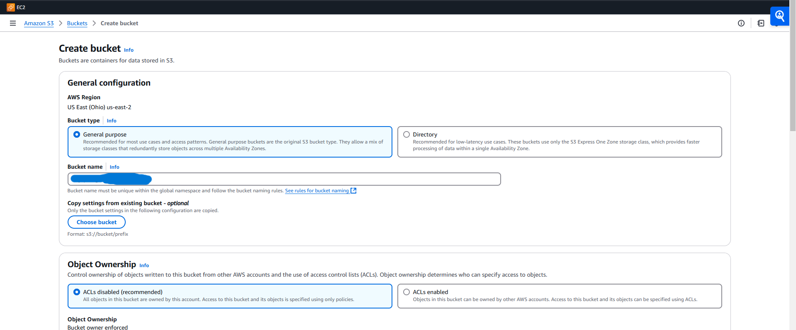

# PhoenixDB

***AWS-RHEL Backup and Recovery*** 

PhoenixDB y is an advanced cloud infrastucture setup that integrates AWS EC2, RHEL 9, and PostgreSQL to provide automated database and system backups with disaster recovery capabilities. The system ensures data resilience through AWS S3 storage, EBS snapshots, and cron-based automation

***Features***
- PostgreSQL Database Setup & Backup

- Automated daily backups to AWS S3

- Secure database access configuration

- System-Level Backup

- Archiving critical system directories (/etc, /home, /var/log)

- Scheduled system-wide backups

- AWS Disaster Recovery

- EBS snapshot creation for full-volume recovery

- Restoration scripts for PostgreSQL & system files

- Security & Best Practices

- SSH key-based authentication

- PostgreSQL user & access restrictions

- IAM roles for secure S3 interactions


## 1. Installation and setup
AWS CLI (Command Line Interface) is required to interact with AWS services programmatically. In this project, it is used to:

Upload backups of PostgreSQL and system files to AWS S3.
Restore data from AWS S3 in case of system failures.
Automate backups using cron to ensure regular data safety.
Manage EBS snapshots for disaster recovery.

***Install AWS CLI*** 

***Update package repositories***
```bash
> sudo dnf update -y
```

***Install AWS CLI***
```bash
> sudo dnf install -y awscli
```

***Verify Installation***
```bash
> aws --version
```

***Configure AWS CLI***                                    
```bash
> aws configure
```

.png)

## 2. AWS EC2 Setup

***Configure Security group rules***
- Allow SSH(port 22)
- Allow PostgreSQL(port 5432)

```bash
> ssh -i "awskey" ezjames@publicIP
```

## 3. PostgreSQL Installation and Configuration  
PostgreSQL was selected because:

It is an open-source relational database with strong ACID compliance (ensuring data integrity).
It supports extensive data types and advanced indexing for high performance.
It offers built-in replication, making it ideal for failover setups.
Strong security features, including role-based access control and SSL encryption.
Well-supported in AWS environments, allowing easy integration with EC2, S3, and RDS

***Install PostgreSQL***
```bash
> sudo dnf install -y postgresql-server postgresql-contrib
```

***Initialize and start PostgreSQL***
```bash
> sudo postgresql-setup --initdb
> sudo systemctl enable --now postgresql
```


***Configure remote access***
```bash
> sudo nano /var/lib/pgsql/data/pg_hba.conf
```

***Allow external connections***
```bash
> sudo nano /var/lib/pgsql/data/pg_hba.conf
```

***Add***
```bash
> host all all 0.0.0.0/0
```


***Restart Postgresql***
```bash
> sudo systemctl restart postgresql
```

***Create a DB and a user***
```sql
CREATE DATABASE clients;
CREATE USER user1 WITH ENCRYPTED PASSWORD ' ';
GRANT ALL PRIVI;EGES ON DATABSES clients TO user1;
```
.png)

## 4. PostgreSQL Backup and Restore
***Backup database to AWS S3***
Create a manual db backup
```bash
> pg_dump -U user1 clients > clients-backup.sql
> aws s3 cp clients-backup.sql s3://pgbackups/
```


***Automate Postgresql backups***
```bash
> crontab -e
```
***Add***
```bash
> 0 2 * * * pg_dump user1 clients | aws s3 cp - s3://pgbackups/clientsbck.sql
```


***Restore DB from s3***
```bash
> aws s3 cp s3://pgbackups/clientsbck.sql/clients-backup.sql
> pswl -U user 1 -d clients -f clients-backup.sql
```

## 5. System Level Backups  
***Backup system files***
```bash
> -czvf /backup/system-backup.tar.gz /etc /home /var/log
> s3 cp /backup/system-backup.tar.gz s3://pgbackups/
```

***Automate system backups***
```bash
> crontab -e
```
***Add***
```bash
> 0 3 * * * tar -czvf /backup/system-backup-$(date + \%F).tar.gz /etc /home /var/log
```
***Restore system backup***
```bash
> aws s3 cp s3://pgbackups/system-backup-YYYY-MM-DD.tar.gz /backup/
> tar -xzvf /backup/system-backup-YYYY-MM-DD.tar.gz -C/
```

## 6. AWS Disaster Recovery  
Why are EBS Snapshots critical for disaster recovery?
EBS (Elastic Block Store) Snapshots are essential because:

They capture the entire state of a disk volume, enabling full system restoration.
They allow quick recovery in case of server failure, minimizing downtime.
Stored in AWS S3, providing durability and resilience.
Can be automated for regular backups using cron jobs.
Supports incremental backups, optimizing storage and cost efficiency.

***Manual EBS Snapshot***
```bash
> aws ec2 create-snapshot --volume-id vol-xxxxxxxx --description "RHEL Backup"
```
***Automate EBS Snapshots***
```bash
> nano /backup-ebs.sh
```
***Add***
```bash
> #!/bin/bash
> VOLUME_ID="vol-xxxxxxxx"
> aws ec2 create-snapshot --volume-id $VOLUME_ID --description "Daily Snapshot"
```
***Make it executable***
```bash
> chmod +x /backup-ebs.sh
```
***Schedule in cron***
```bash
> crontab -e
```
***Add***
```bash
> 0 4 * * * /backup-ebs.sh
```



  
